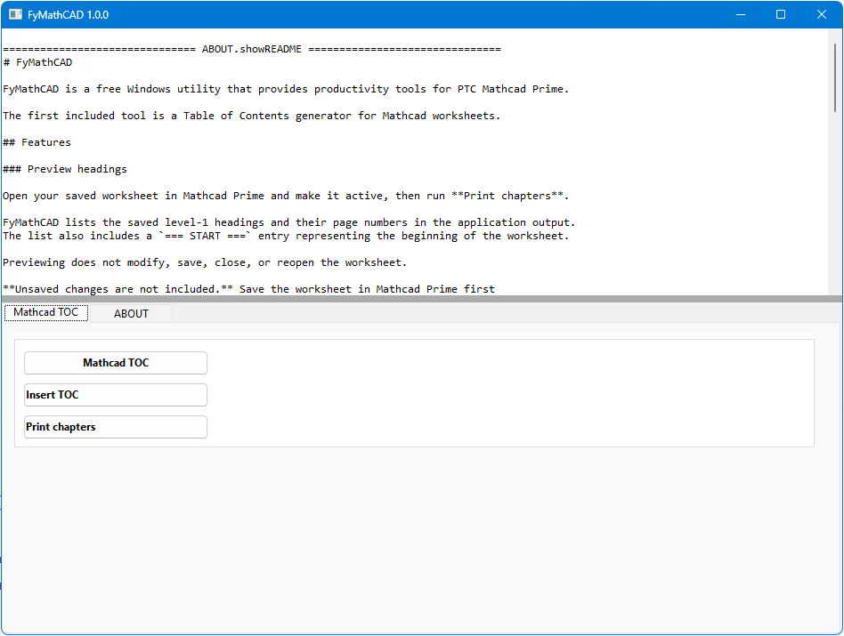

# FyMathCAD

FyMathCAD is a free Windows utility that provides productivity tools for PTC Mathcad Prime.

The first included tool is a Table of Contents generator for Mathcad worksheets.

## Features

### Preview headings

Open your saved worksheet in Mathcad Prime and make it active, then run **Print chapters**.

FyMathCAD lists the saved level-1 headings and their page numbers in the application output.
The list also includes a `=== START ===` entry representing the beginning of the worksheet.

Previewing does not modify, save, close, or reopen the worksheet.

**Unsaved changes are not included.** Save the worksheet in Mathcad Prime first
if you want to preview your latest edits.

### Insert table of contents

Run **Insert TOC** to insert or replace the recognized table of contents,
renumber recognized heading captions, and adjust the layout and page numbers.

The generated TOC includes level-1 headings, with clickable links to the corresponding headings.

**The worksheet is modified in place.**

Before replacing the worksheet, FyMathCAD validates the prepared file and
creates a timestamped backup in a `__backup` folder beside the original worksheet.
The backup location is shown in the application output.

The active worksheet is selected at the start of each graphical action.

When **Insert TOC** is run, FyMathCAD saves any unsaved changes and closes the worksheet before editing it.
After processing, it attempts to reopen the worksheet even if TOC insertion fails.

Untitled worksheets must first be saved as `.mcdx` files in Mathcad Prime.

## Troubleshooting

* **No headings found:** Use Mathcad heading styles for level-1 headings.
  Visually prominent text alone may not be recognized as a heading.
* **Cannot connect to the worksheet:** Open Mathcad Prime, make the worksheet active,
  and save it as an `.mcdx` file before retrying.
* **Worksheet does not reopen:** Open it manually in Mathcad Prime.
* **Unexpected results:** Review the worksheet layout and page numbers after TOC insertion.
  To restore a backup, close the worksheet and copy the desired timestamped file
  from the `__backup` folder to the original location and filename, replacing the modified worksheet.

## License

Freeware for personal and commercial use.

Copyright © 2026 spectereye@gmail.com. All rights reserved.

See `LICENSE.txt` for license terms.

## Updates

For updates and more engineering tools, visit:

https://tool.biggg.fun
